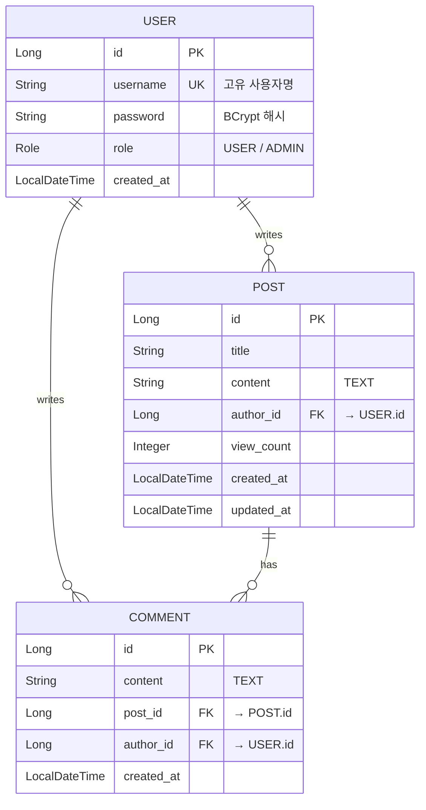

# Chapter 09: Final Project - 게시판 REST API

> **🐳 실습 환경 — 이 장은 `spring-ch09-board` 컨테이너(+ 전용 `spring-ch09-postgres`/`spring-ch09-redis`/`spring-ch09-adminer`)로 실습한다**
> ```bash
> cd spring/chapter09-final-project && docker compose up --build
> ```
> 위 명령 한 방으로 앱+DB+Redis+Adminer(8081)가 모두 뜬다 (공통 인프라 `spring-postgres`/`spring-redis`/`spring-adminer`와 동시에 띄우면 5432/6379/8081 포트 충돌 주의).
> API 호출은 `requests.http` 파일로 (VS Code REST Client). 컨테이너 상태 확인: `docker ps`

## 프로젝트 개요

이 프로젝트는 Chapter 01~08에서 배운 모든 내용을 종합하여 만드는 **게시판(Board) REST API** 입니다.
Spring Boot, Spring Security(JWT), Spring Data JPA, PostgreSQL, Docker Compose를 활용하여
실무 수준의 백엔드 애플리케이션을 구축합니다.

## 사용 기술

| 기술 | 버전 | 용도 |
|------|------|------|
| Java | 21 | 언어 |
| Spring Boot | 3.3.0 | 프레임워크 |
| Spring Security | - | 인증/인가 (JWT) |
| Spring Data JPA | - | ORM |
| PostgreSQL | 16 | 데이터베이스 |
| Docker Compose | - | 컨테이너 오케스트레이션 |
| Testcontainers | 1.19.8 | 통합 테스트 |

## 기능 목록

### 1. 회원 (Auth)
- 회원가입 (POST /api/auth/signup)
- 로그인 (POST /api/auth/login) - JWT 토큰 발급

### 2. 게시글 (Post)
- 게시글 목록 조회 (GET /api/posts) - 페이징, 검색 지원
- 게시글 상세 조회 (GET /api/posts/{id}) - 조회수 증가
- 게시글 작성 (POST /api/posts) - 인증 필요
- 게시글 수정 (PUT /api/posts/{id}) - 작성자만 가능
- 게시글 삭제 (DELETE /api/posts/{id}) - 작성자 또는 관리자

### 3. 댓글 (Comment)
- 댓글 목록 조회 (GET /api/posts/{postId}/comments)
- 댓글 작성 (POST /api/posts/{postId}/comments) - 인증 필요
- 댓글 삭제 (DELETE /api/posts/{postId}/comments/{commentId}) - 작성자 또는 관리자

---

## ERD 및 아키텍처

### 데이터 모델 (ERD)

세 개의 엔티티가 다음과 같은 1:N 관계로 연결됩니다.

- **User (1) ─ (N) Post** : 한 사용자는 여러 게시글을 작성
- **Post (1) ─ (N) Comment** : 한 게시글에 여러 댓글
- **User (1) ─ (N) Comment** : 한 사용자는 여러 댓글을 작성



> Mermaid를 지원하지 않는 뷰어를 위한 텍스트 ERD:
>
> ```
>            ┌──────────┐
>            │   USER   │  id(PK), username(UK), password, role, created_at
>            └────┬─────┘
>        author_id│ (1)         author_id│ (1)
>          ┌──────┴───────┐  ┌───────────┴──────┐
>          ▼ (N)          │  ▼ (N)
>     ┌──────────┐        │  └──────────────┐
>     │   POST   │ id(PK) │                 │
>     │  title, content,  │                 │
>     │  author_id(FK),   │                 │
>     │  view_count, ...  │                 │
>     └────┬─────┘        │                 │
>  post_id │ (1)          │                 │
>          ▼ (N)          │                 ▼ (N)
>     ┌─────────────────────────────────────────┐
>     │ COMMENT  id(PK), content, post_id(FK),   │
>     │          author_id(FK), created_at       │
>     └─────────────────────────────────────────┘
> ```

### 계층형 아키텍처 (Layered Architecture)

요청은 위에서 아래로 흐르며, 각 계층은 바로 아래 계층에만 의존합니다.

```
HTTP 요청
   │
   ▼
[ Controller ]  ── @RestController : 요청/응답 매핑, DTO 변환, 인증 사용자 주입
   │  (DTO)
   ▼
[ Service ]     ── @Service : 비즈니스 로직, 트랜잭션(@Transactional), 권한 검증
   │  (Entity)
   ▼
[ Repository ]  ── Spring Data JPA : DB 접근 (CRUD, 페이징, 검색)
   │
   ▼
[ PostgreSQL ]
```

- **Controller → Service → Repository** 단방향 의존으로 책임을 분리합니다.
- 가로 관심사: `SecurityConfig` + `JwtAuthenticationFilter`가 인증을, `GlobalExceptionHandler`가 전역 예외를 처리합니다.
- 엔티티는 계층 밖으로 노출하지 않고 **DTO(record)** 로 변환해 응답합니다.

---

## API 명세표

### Auth API

| Method | URL | 설명 | 인증 |
|--------|-----|------|------|
| POST | `/api/auth/signup` | 회원가입 | X |
| POST | `/api/auth/login` | 로그인 | X |

#### 회원가입 요청
```json
{
  "username": "testuser",
  "password": "password123"
}
```

#### 로그인 응답
```json
{
  "token": "eyJhbGciOiJIUzI1NiJ9...",
  "username": "testuser"
}
```

### Post API

| Method | URL | 설명 | 인증 |
|--------|-----|------|------|
| GET | `/api/posts?page=0&size=10&keyword=검색어` | 게시글 목록 (페이징/검색) | X |
| GET | `/api/posts/{id}` | 게시글 상세 조회 | X |
| POST | `/api/posts` | 게시글 작성 | O |
| PUT | `/api/posts/{id}` | 게시글 수정 | O (작성자) |
| DELETE | `/api/posts/{id}` | 게시글 삭제 | O (작성자/관리자) |

#### 게시글 작성 요청
```json
{
  "title": "게시글 제목",
  "content": "게시글 내용입니다."
}
```

#### 게시글 상세 응답
```json
{
  "id": 1,
  "title": "게시글 제목",
  "content": "게시글 내용입니다.",
  "author": "testuser",
  "viewCount": 5,
  "commentCount": 3,
  "createdAt": "2024-01-01T12:00:00"
}
```

### Comment API

| Method | URL | 설명 | 인증 |
|--------|-----|------|------|
| GET | `/api/posts/{postId}/comments` | 댓글 목록 조회 | X |
| POST | `/api/posts/{postId}/comments` | 댓글 작성 | O |
| DELETE | `/api/posts/{postId}/comments/{commentId}` | 댓글 삭제 | O (작성자/관리자) |

#### 댓글 작성 요청
```json
{
  "content": "댓글 내용입니다."
}
```

---

## Docker Compose로 전체 실행하기

### 사전 준비
- Docker Desktop 설치
- Java 21 (로컬 빌드 시)

### 실행 방법

```bash
# 1. 프로젝트 디렉토리로 이동 (저장소 루트 기준)
cd spring/chapter09-final-project

# 2. Docker Compose로 전체 실행 (빌드 포함)
docker compose up --build

# 3. 백그라운드 실행
docker compose up --build -d

# 4. 로그 확인
docker compose logs -f app

# 5. 종료
docker compose down

# 6. 볼륨까지 삭제 (DB 데이터 초기화)
docker compose down -v
```

### 실행되는 서비스

| 서비스 | 포트 | 설명 |
|--------|------|------|
| app | 8080 | Spring Boot 애플리케이션 |
| postgres | 5432 | PostgreSQL 데이터베이스 |
| redis | 6379 | Redis (추후 캐시 확장용) |
| adminer | 8081 | DB 관리 웹 UI |

---

## 테스트 방법 (curl 예제)

### 1. 회원가입
```bash
curl -X POST http://localhost:8080/api/auth/signup \
  -H "Content-Type: application/json" \
  -d '{"username": "testuser", "password": "password123"}'
```

### 2. 로그인
```bash
curl -X POST http://localhost:8080/api/auth/login \
  -H "Content-Type: application/json" \
  -d '{"username": "testuser", "password": "password123"}'
```

응답에서 받은 토큰을 환경변수에 저장:
```bash
TOKEN="여기에_토큰_붙여넣기"
```

### 3. 게시글 작성
```bash
curl -X POST http://localhost:8080/api/posts \
  -H "Content-Type: application/json" \
  -H "Authorization: Bearer $TOKEN" \
  -d '{"title": "첫 번째 게시글", "content": "안녕하세요! 첫 게시글입니다."}'
```

### 4. 게시글 목록 조회 (페이징)
```bash
# 기본 조회 (page=0, size=10)
curl http://localhost:8080/api/posts

# 페이지 지정
curl "http://localhost:8080/api/posts?page=0&size=5"

# 키워드 검색
curl "http://localhost:8080/api/posts?keyword=첫+번째"
```

### 5. 게시글 상세 조회
```bash
curl http://localhost:8080/api/posts/1
```

### 6. 게시글 수정
```bash
curl -X PUT http://localhost:8080/api/posts/1 \
  -H "Content-Type: application/json" \
  -H "Authorization: Bearer $TOKEN" \
  -d '{"title": "수정된 제목", "content": "수정된 내용입니다."}'
```

### 7. 게시글 삭제
```bash
curl -X DELETE http://localhost:8080/api/posts/1 \
  -H "Authorization: Bearer $TOKEN"
```

### 8. 댓글 작성
```bash
curl -X POST http://localhost:8080/api/posts/1/comments \
  -H "Content-Type: application/json" \
  -H "Authorization: Bearer $TOKEN" \
  -d '{"content": "좋은 글이네요!"}'
```

### 9. 댓글 목록 조회
```bash
curl http://localhost:8080/api/posts/1/comments
```

### 10. 댓글 삭제
```bash
curl -X DELETE http://localhost:8080/api/posts/1/comments/1 \
  -H "Authorization: Bearer $TOKEN"
```

---

## 프로젝트 구조

```
chapter09-final-project/
├── build.gradle
├── settings.gradle
├── Dockerfile
├── docker-compose.yml
└── src/
    ├── main/
    │   ├── java/com/edu/board/
    │   │   ├── Chapter09Application.java
    │   │   ├── entity/
    │   │   │   ├── User.java
    │   │   │   ├── Role.java
    │   │   │   ├── Post.java
    │   │   │   └── Comment.java
    │   │   ├── repository/
    │   │   │   ├── UserRepository.java
    │   │   │   ├── PostRepository.java
    │   │   │   └── CommentRepository.java
    │   │   ├── dto/
    │   │   │   ├── SignUpRequest.java
    │   │   │   ├── LoginRequest.java
    │   │   │   ├── AuthResponse.java
    │   │   │   ├── PostRequest.java
    │   │   │   ├── PostResponse.java
    │   │   │   ├── PostListResponse.java
    │   │   │   ├── CommentRequest.java
    │   │   │   ├── CommentResponse.java
    │   │   │   └── PageResponse.java
    │   │   ├── service/
    │   │   │   ├── JwtService.java
    │   │   │   ├── AuthService.java
    │   │   │   ├── PostService.java
    │   │   │   └── CommentService.java
    │   │   ├── config/
    │   │   │   ├── SecurityConfig.java
    │   │   │   └── JwtAuthenticationFilter.java
    │   │   ├── controller/
    │   │   │   ├── AuthController.java
    │   │   │   ├── PostController.java
    │   │   │   └── CommentController.java
    │   │   └── exception/
    │   │       ├── GlobalExceptionHandler.java
    │   │       ├── ResourceNotFoundException.java
    │   │       └── UnauthorizedException.java
    │   └── resources/
    │       └── application.yml
    └── test/
        └── java/com/edu/board/
            └── PostApiIntegrationTest.java
```

## 학습 포인트

1. **Spring Security + JWT** - 토큰 기반 인증/인가 구현
2. **JPA 연관관계** - @ManyToOne, @OneToMany 매핑
3. **DTO 패턴** - Record를 활용한 요청/응답 분리
4. **페이징 & 검색** - Spring Data JPA의 Pageable 활용
5. **예외 처리** - @RestControllerAdvice를 통한 전역 예외 처리
6. **Docker Compose** - 멀티 컨테이너 환경 구성
7. **Testcontainers** - 실제 DB를 사용한 통합 테스트

---

## 도전 과제 (Challenge Exercises)

> 학습계획 **Day 37~38(직접 기능 추가)** 와 연결되는 실전 과제입니다.
> 지금까지 읽은 코드를 직접 확장해 보며 손에 익히는 단계입니다.
> 참고 답안은 [`solutions/like-feature/`](./solutions/like-feature/)에 있으니,
> **먼저 스스로 구현한 뒤** 결과를 비교해 보세요.

### 과제 1 (Day 37~38): 게시글 좋아요(Like) 기능 추가

게시글에 "좋아요"를 누르고 취소할 수 있는 기능을 추가합니다.
한 사용자는 한 게시글에 **좋아요를 한 번만** 누를 수 있어야 합니다.

단계별 가이드:

1. **`Like` 엔티티 생성** (`entity/Like.java`)
   - `@ManyToOne` 으로 `User`, `Post` 참조 (지연 로딩, `Comment`와 같은 패턴)
   - `(user_id, post_id)` **복합 유니크 제약**을 걸어 중복 좋아요를 DB 차원에서 방지
     ```java
     @Table(name = "post_like",
            uniqueConstraints = @UniqueConstraint(columnNames = {"user_id", "post_id"}))
     ```
   - 힌트: `like`는 SQL 예약어이므로 테이블명은 `post_like`로 지정

2. **`LikeRepository` 생성** (`repository/LikeRepository.java`)
   - `boolean existsByUserIdAndPostId(Long userId, Long postId)` — 이미 눌렀는지 확인
   - `Optional<Like> findByUserIdAndPostId(Long userId, Long postId)` — 취소 시 대상 조회
   - `long countByPostId(Long postId)` — 좋아요 개수 집계

3. **`LikeService` 생성** (`service/LikeService.java`)
   - `long like(Long postId, User user)` — 게시글 존재 확인 → 미존재 시에만 저장 → 개수 반환
   - `long unlike(Long postId, User user)` — 좋아요가 있으면 삭제 → 개수 반환
   - (선택) `long toggle(...)` — 있으면 삭제, 없으면 추가하는 토글 방식
   - 중복/동시성: `existsBy...`로 1차 검증 + 유니크 제약 위반(`DataIntegrityViolationException`) 무시로 멱등 보장

4. **`LikeController` 생성** (`controller/LikeController.java`)
   - `POST   /api/posts/{postId}/likes` — 좋아요 추가
   - `DELETE /api/posts/{postId}/likes` — 좋아요 취소
   - `@AuthenticationPrincipal User user`로 인증 사용자 주입 (다른 컨트롤러와 동일)
   - `SecurityConfig`는 `GET /api/posts/**`만 허용하므로, 위 POST/DELETE는 **별도 설정 없이 인증 필요**

5. **확인**: 같은 사용자가 좋아요를 두 번 눌러도 개수가 1로 유지되는지, 토큰 없이 호출하면 401이 나오는지 확인

### 과제 2 (Day 38): 제목 검색을 제목+내용 검색으로 확장

현재 검색은 **제목만** 대상으로 합니다.
`PostRepository`의 `findByTitleContaining(...)` 한 가지만 사용하기 때문입니다.

이를 **제목 또는 내용** 어느 쪽에 키워드가 있어도 검색되도록 확장합니다.

1. `PostRepository`에 메서드 추가:
   ```java
   Page<Post> findByTitleContainingOrContentContaining(
           String titleKeyword, String contentKeyword, Pageable pageable);
   ```
   - 또는 `@Query("... WHERE p.title LIKE %:kw% OR p.content LIKE %:kw%")`로 키워드 하나만 받도록 작성
2. `PostService.getPosts(...)`에서 키워드 검색 분기를 새 메서드로 교체
3. 제목에는 없고 **내용에만** 키워드가 있는 게시글이 검색 결과에 포함되는지 확인

### 과제 3 (Day 38): 좋아요 기능 테스트 작성

`PostApiIntegrationTest`를 참고하여 좋아요 기능의 통합 테스트를 작성합니다.

- 좋아요 추가 후 개수가 1 증가하는지
- 같은 사용자가 다시 눌러도 개수가 그대로인지(중복 방지)
- 좋아요 취소 후 개수가 감소하는지
- 토큰 없이 좋아요 요청 시 **401 Unauthorized** 인지
